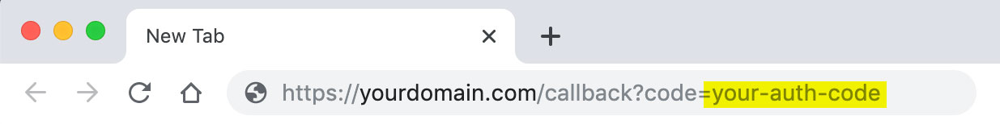

# Commerce Layer JS Auth

A JavaScript Library wrapper that helps you use the Commerce Layer API for [Authentication](https://docs.commercelayer.io/developers/authentication).

## What is Commerce Layer?

[Commerce Layer](https://commercelayer.io) is a multi-market commerce API and order management system that lets you add global shopping capabilities to any website, mobile app, chatbot, wearable, voice, or IoT device, with ease. Compose your stack with the best-of-breed tools you already mastered and love. Make any experience shoppable, anywhere, through a blazing-fast, enterprise-grade, and secure API.

## Table of contents

- [Getting started](#getting-started)
  - [Installation](#installation)
  - [Using E6 import](#using-es6-import)
- [Authorization flows](#authorization-flows)
- [Use cases](#use-cases)
  - [Sales channel application with client credentials flow](#sales-channel-client-credentials)
  - [Sales channel application with password flow](#sales-channel-password)
  - [Integration application with client credentials flow](#integration-client-credentials)
  - [Webapp application with authorization code flow](#webapp-authorization-code)
- [Contributors guide](#contributors-guide)
- [Need help?](#need-help)
- [License](#license)

---

## Getting started

To get started with Commerce Layer JS Auth, you need to install it and add it to your project.

### Installation

Commerce Layer JS Auth is available as an npm package.

```
// npm
npm install @commercelayer/js-auth

// yarn
yarn add @commercelayer/js-auth
```

### Using ES6 import

You can use either the ES6 default or single/multiple named import with the SDK as follow:

```
import CLayerAuth from '@commercelayer/js-auth'

// or

import { authentication } from '@commercelayer/js-auth'
```

> In the examples below, we will use the latter solution (named import) and define only the functions we need, based on what kind of app and authorization flow we're going to use.

## Authorization flows

To get an access token, you need to execute an [OAuth 2.0](https://oauth.net/2/) authorization flow by using a valid application as the client.

| Grant type             | Sales channel | Integration | Webapp |
| ---------------------- | ------------- | ----------- | ------ |
| **Client credentials** | ✅            | ✅          |        |
| **Password**           | ✅            |             |        |
| **Refresh token**      | ✅            |             | ✅     |
| **Authorization code** |               |             | ✅     |

> Remember that, for security reasons, access tokens expire after **2 hours**. Authorization codes expire after **10 minutes**.

Check our [documentation](https://docs.commercelayer.io/developers/authentication) for further information on each single authorization flow.

## Use cases

Based on the authorization flow and application you want to use, you can get your access token in a few simple steps. These are the most common use cases:

- [Sales channel application with client credentials flow](#sales-channel-client-credentials)
- [Sales channel application with password flow](#sales-channel-password)
- [Integration application with client credentials flow](#integration-client-credentials)
- [Webapp application with authorization code flow](#webapp-authorization-code)

### Sales channel (client credentials)

Sales channel applications use the [client credentials](https://docs.commercelayer.io/developers/authentication/client-credentials) grant type to get a "guest" access token.

#### Steps

1. Create a **sales channel** application on Commerce Layer and take note of your API credentials (base endpoint, client ID, and the ID of the market you want to put in scope)

2. Use this code to get your access token:

```ts
  const token = await authentication('client_credentials', {
    clientId: 'your-client-id',
    slug: 'your-organization-slug',
    scope: 'market:{id}'
  })
  
  console.log('My access token: ', token.accessToken)
  console.log('Expiration date: ', token.expires)
```

### Sales channel (password)

Sales channel applications can use the [password](https://docs.commercelayer.io/developers/authentication/password) grant type to exchange a customer credentials for an access token (i.e., to get a "logged" access token).

#### Steps

1. Create a **sales channel** application on Commerce Layer and take note of your API credentials (base endpoint, client ID, and the ID of the market you want to put in scope)

2. Use this code (changing user name and password with the customer credentials) to get the access token:

```ts
  const token = await authentication('password', {
    clientId: 'your-client-id',
    slug: 'your-organization-slug',
    scope: 'market:{id}'
    username: 'john@example.com',
    password: 'secret'
  })
  
  console.log('My access token: ', token.accessToken)
  console.log('Expiration date: ', token.expires)
  console.log('My refresh token: ', token.refreshToken)
  ```

Sales channel applications can use the [refresh token](https://docs.commercelayer.io/developers/authentication/refresh-token) grant type to refresh a customer access token with a "remember me" option:

```ts
  const newToken = await authentication('refresh_token', {
    clientId: 'your-client-id',
    slug: 'your-organization-slug',
    scope: 'market:{id}',
    refreshToken: 'your-refresh-token'
  })
```

### Integration (client credentials)

Integration applications use the [client credentials](https://docs.commercelayer.io/developers/authentication/client-credentials) grant type to get an access token for themselves.

#### Steps

1. Create an **integration** application on Commerce Layer and take note of your API credentials (client ID, client secret, and base endpoint)

2. Use this code to get the access token:

```ts
   const token = await authentication('client_credentials', {
     clientId: 'your-client-id',
     clientSecret: 'your-client-secret',
     slug: 'your-organization-slug',
   })

   console.log('My access token: ', token.accessToken)
   console.log('Expiration date: ', token.expires)
```

### Webapp (authorization code)

> Available only for browser applications

Webapp applications use the [authorization code](https://docs.commercelayer.io/developers/authentication/authorization-code) grant type to exchange an authorization code for an access token.

#### Steps

In this case, first, you need to get an authorization code, then you can exchange it with an access token:

1. Create a **webapp** application on Commerce Layer and take note of your API credentials (client ID, client secret, callback URL, base endpoint, and the ID of the market you want to put in scope)

2. Use this code to authorize your webapp on Commerce Layer:

  ```bash
    curl -g -X GET \
    'https://dashboard.commercelayer.io/oauth/authorize?client_id=your-client-id&redirect_uri=https://yourdomain.com/redirect&scope=market:1234&response_type=code' \
    -H 'Accept: application/json' \
    -H 'Content-Type: application/json'
  ```
  
  or copy and paste this URL in your browser:
  
  ```bash
    https://dashboard.commercelayer.io/oauth/authorize?client_id=your-client-id&redirect_uri=https://yourdomain.com/redirect&scope=market:1234&response_type=code
  ```
  
3. Once you've authorized the application, you will be redirected to the callback URL:

   

   Use this code to get the access token:

  ```ts
     const token = await authentication('authorization_code', {
       clientId: 'your-client-id',
       clientSecret: 'your-client-secret',
       callbackUrl: '<https://yourdomain.com/callback>',
       slug: 'your-organization-slug',
       scope: 'market:{id}',
       code: 'your-auth-code'
     })
  
     console.log('My access token: ', token.accessToken)
     console.log('Expiration date: ', token.expires)
  ```
  
---

## Contributors guide

1. Fork [this repository](https://github.com/BolajiAyodeji/commercelayer-js-auth) (learn how to do this [here](https://help.github.com/articles/fork-a-repo)).

2. Clone the forked repository like so:

```bash
git clone https://github.com/<your username>/commercelayer-js-auth.git && cd commercelayer-js-auth
```

3. Make your changes and create a pull request ([learn how to do this](https://docs.github.com/en/github/collaborating-with-issues-and-pull-requests/creating-a-pull-request)).

4. Someone will attend to your pull request and provide some feedback.

## Need help?

1. Request an invite to join [Commerce Layer's Slack community](https://slack.commercelayer.app/).

2. Create an [issue](https://github.com/commercelayer/commercelayer-js-auth/issues) in this repository.

3. Ping us [on Twitter](https://twitter.com/commercelayer).

## License

This repository is published under the [MIT](LICENSE) license.
