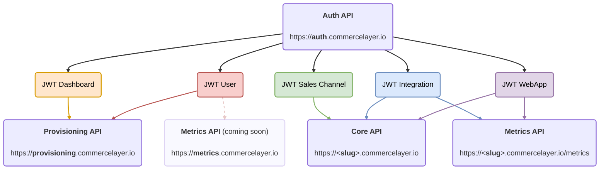
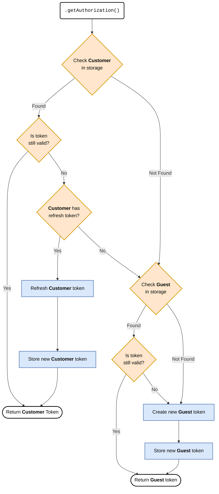

# Commerce Layer JS Auth

A lightweight JavaScript library designed to simplify [authentication](https://docs.commercelayer.io/developers/authentication) when interacting with the Commerce Layer API. It provides a robust token caching system out-of-the-box, with support for configurable persistent storage, composite storage strategies, and dedicated customer token management.

It works everywhere — on your browser, server, or at the edge.

## What is Commerce Layer? <!-- omit from toc -->

[Commerce Layer](https://commercelayer.io) is a multi-market commerce API and order management system that lets you add global shopping capabilities to any website, mobile app, chatbot, wearable, voice, or IoT device, with ease. Compose your stack with the best-of-breed tools you already mastered and love. Make any experience shoppable, anywhere, through a blazing-fast, enterprise-grade, and secure API.

## Table of contents <!-- omit from toc -->

- [Getting started](#getting-started)
- [API credentials](#api-credentials)
  - [Storage strategy](#storage-strategy)
    - [Debugging and storage names](#debugging-and-storage-names)
    - [Using unstorage](#using-unstorage)
  - [Sales channel](#sales-channel)
    - [Password-based customer authentication](#password-based-customer-authentication)
    - [JWT bearer authentication](#jwt-bearer-authentication)
  - [Integration](#integration)
- [Other flows](#other-flows)
  - [Webapp application with authorization code flow](#webapp-application-with-authorization-code-flow)
  - [Provisioning application](#provisioning-application)
  - [Client credentials flow](#client-credentials-flow)
- [Utilities](#utilities)
  - [Revoking a token](#revoking-a-token)
  - [Decoding an access token](#decoding-an-access-token)
  - [Verifying an access token](#verifying-an-access-token)
  - [Getting the Core API base endpoint](#getting-the-core-api-base-endpoint)
  - [Getting the Provisioning API base endpoint](#getting-the-provisioning-api-base-endpoint)
- [Contributors guide](#contributors-guide)
- [Need help?](#need-help)
- [License](#license)

---

## Getting started

To get started with Commerce Layer JS Auth, you need to install it and add it to your project.

[](https://www.npmjs.com/package/@commercelayer/js-auth)
[](https://jsr.io/@commercelayer/js-auth)

&nbsp;&nbsp;&nbsp;
[](https://discord.gg/commercelayer)

### Installation <!-- omit from toc --> 

Commerce Layer JS Auth is available as an npm package.

```bash
# npm
npm install @commercelayer/js-auth

# yarn
yarn add @commercelayer/js-auth

# pnpm
pnpm add @commercelayer/js-auth

# deno
deno add jsr:@commercelayer/js-auth

# bun
bun add @commercelayer/js-auth
```

## API credentials

Commerce Layer implements the industry-standard [OAuth 2.0](https://oauth.net/2/) protocol to manage clients' authorization. It defines different types of API credentials. Which one to use depends on your specific needs.

> [!NOTE]
> Check our [API credentials documentation](https://docs.commercelayer.io/core/api-credentials) for further information for each credential type and learn how to create them through the Commerce Layer dashboard.

To use Commerce Layer API you need to be authorized in the first place. This means you need to get a valid access token.



Authentication calls are subject to [rate limiting](https://docs.commercelayer.io/core/rate-limits#authentication-endpoint). To avoid hitting these limits, you should cache the authentication token in a storage (e.g., cookies, Redis, KV). This prevents requesting a new token for each API call.

This library provides a robust token caching system out-of-the-box, with support for any storage solution you choose. It includes tools for composing multiple storage mechanisms (e.g., memory + Redis) to reduce load on the underlying configured storage, and provides dedicated customer token management.

> [!NOTE]
> For advanced use cases where you need direct control over token management, you can bypass the built-in caching helpers (`makeSalesChannel` and `makeIntegration`) and [use the `authenticate` method directly](#client-credentials-flow).

### Storage strategy

- **Single storage** — Provides temporary or persistent storage that can survive page reloads. You can implement any storage solution.
- **Composite storage** — Using the `createCompositeStorage` helper, you can combine multiple storage mechanisms (e.g., memory + Redis) to optimize performance and reduce load on the underlying configured storage.
- **Customer storage** (*sales channel only*) — Optional dedicated storage for customer authentication tokens, separate from guest tokens.

Here below an example showing a basic setup with an in-memory storage:

```ts
import {
  makeSalesChannel,
  type Storage,
  type StorageValue,
} from "@commercelayer/js-auth"

/**
 * A valid storage must implement the `Storage` interface
 */
function memoryStorage(): Storage {
  const store = new Map<string, StorageValue>()
  return {
    name: "in-memory",
    async getItem(key) {
      return store.get(key) ?? null
    },
    async setItem(key: string, value: StorageValue) {
      store.set(key, value)
    },
    async removeItem(key: string) {
      store.delete(key)
    },
  }
}

const salesChannel = makeSalesChannel(
  {
    clientId: "<your_client_id>",
    scope: "market:code:europe",
    debug: true,
  },
  {
    storage: memoryStorage(),
  },
)

/**
 * At the beginning, you'll get a guest token
 */
const authorization1 = await salesChannel.getAuthorization()

console.log("Guest access token:", authorization1.accessToken)

/**
 * For consecutive calls, you'll get the previous guest token
 * from the storage or a new one if expired
 */
const authorization2 = await salesChannel.getAuthorization()

console.log("Customer access token:", authorization2.accessToken)
```

The following flowchart illustrates how the library manages token caching, validation, and refresh flow:



#### Debugging and storage names

You can enable debugging and assign custom names to your storage instances for better visibility into token operations:

- **`debug`** — When set to `true`, logs detailed information about token operations (creation, retrieval, refresh, etc.).
- **`name`** — A custom identifier for your storage instance, useful when using multiple storages or composite storage configurations. The `name` is an attribute of the storage itself (as shown in the [`memoryStorage` example above](#storage-strategy)).

```diff
 const salesChannel = makeSalesChannel(
   {
     clientId: "<your_client_id>",
     scope: "market:code:europe",
+    debug: true,
   },
   {
     storage: {
+      name: "storage-name",
       async getItem(key) {
         // implementation
       },
       // ...
     }
   },
 )
```

#### Using unstorage

The `Storage` interface is fully compatible with the [`unstorage`](https://unstorage.unjs.io) library. However, `unstorage` doesn't include a `name` property by default. To enable debugging and identify which storage is being used in your logs, wrap `createStorage` with this helper:

```ts
import type { Storage } from "@commercelayer/js-auth"
import type { CreateStorageOptions } from "unstorage"
import { createStorage as unstorageCreateStorage } from "unstorage"

// Helper to create storage with explicit naming support
function createStorage(
  options: CreateStorageOptions & { name?: string },
): Storage {
  return {
    name: options.name ?? options.driver?.name,
    ...unstorageCreateStorage(options),
  }
}
```

```ts
// Usage example
import redisDriver from "unstorage/drivers/redis"

const redisStorage = createStorage({
  name: "redis-persistent",
  driver: redisDriver({
    url: "<your_redis_connection_string>",
  }),
})
```

When debugging is enabled, logs will include the storage name, making it easier to trace which storage layer is handling each operation.

### Sales channel

[Sales channels](https://docs.commercelayer.io/core/api-credentials#sales-channel) are used to build any customer touchpoint (e.g. your storefront with a fully-functional shopping cart and checkout flow).

Below is a complete example showing how to use a sales channel for both guest and customer authentication:

```ts
import { authenticate, makeSalesChannel } from "@commercelayer/js-auth"

// The `Storage` interface is fully-compatible with the `unstorage` library.
import { createStorage } from "unstorage"
import localStorageDriver from "unstorage/drivers/localstorage"

const salesChannel = makeSalesChannel(
  {
    clientId: "<your_client_id>",
    scope: "market:code:europe",
  },
  {
    /**
     * You can use any storage implementation you prefer or implement your own.
     * In this example we use `unstorage` with the `localStorage` driver
     */
    storage: createStorage({
      driver: localStorageDriver({}),
    }),
  },
)

/**
 * Get the current authorization state which includes the access token.
 * This method handles caching and token refresh automatically.
 */
const guestAuthorization = await salesChannel.getAuthorization()

console.log("Guest access token:", guestAuthorization.accessToken)

/**
 * Authenticate a customer using their email and password, or
 * though the JWT bearer flow.
 */
const customerCredentials = await authenticate("password", {
  clientId: "<your_client_id>",
  scope: "market:code:europe",
  username: "john@example.com",
  password: "secret",
})

/**
 * Set the customer credentials in the storage.
 */
await salesChannel.setCustomer({
  accessToken: customerCredentials.accessToken,
  scope: customerCredentials.scope,

  /**
   * When `refreshToken` is provided, it'll be used to automatically
   * refresh the customer access token when it expires.
   */
  refreshToken: customerCredentials.refreshToken,
})

/**
 * Get the current customer authorization.
 */
const customerAuthorization = await salesChannel.getAuthorization()

console.log("Customer access token:", customerAuthorization.accessToken)

/**
 * Logout the current customer.
 * This will remove the customer authorization from the storage, and revoke the access token.
 */
await salesChannel.logoutCustomer()
```

Customer authentication is supported through two OAuth 2.0 grant types: [password](#password-based-customer-authentication) and [JWT bearer](#jwt-bearer-authentication). Both flows return an `accessToken`, `scope`, and `refreshToken` that can be stored using the `setCustomer` method.

#### Password-based customer authentication

Sales channels can use the [password](https://docs.commercelayer.io/developers/authentication/password) grant type to exchange customer credentials for an access token (i.e., to get a "logged" access token).

```ts
import { authenticate } from "@commercelayer/js-auth"

const auth = await authenticate("password", {
  clientId: "<your_client_id>",
  scope: "market:code:europe"
  username: "john@example.com",
  password: "secret"
})

console.log("My access token:", auth.accessToken)
console.log("Expiration date:", auth.expires)
console.log("My refresh token:", auth.refreshToken)
```

Sales channels can use the [refresh token](https://docs.commercelayer.io/developers/authentication/refresh-token) grant type to refresh a customer access token with a "remember me" option:

```ts
import { authenticate } from "@commercelayer/js-auth"

const newToken = await authenticate("refresh_token", {
  clientId: "<your_client_id>",
  scope: "market:code:europe"
  refreshToken: "<your_refresh_token>"
})
```

> [!NOTE]
> When using the `makeSalesChannel` helper, token refresh is handled automatically. The helper monitors token expiration and seamlessly refreshes customer tokens in the background, eliminating the need for manual refresh calls.


#### JWT bearer authentication

Commerce Layer supports OAuth 2.0 [JWT Bearer](https://docs.commercelayer.io/core/authentication/jwt-bearer) token exchange, enabling applications to obtain access tokens by exchanging JWT assertions. This is particularly useful for implementing delegated authentication flows, where an application needs to make API calls on behalf of a customer without requiring their direct interaction. The flow consists of two steps:

1. Creating a signed JWT assertion containing the customer's claims

    ```ts
    const assertion = await createAssertion({
      payload: {
        "https://commercelayer.io/claims": {
          owner: {
            type: "Customer",
            id: "4tepftJsT2"
          },
          custom_claim: {
            customer: {
              first_name: "John",
              last_name: "Doe"
            }
          }
        }
      }
    })
    ```

2. Exchanging this assertion for an access token

    ```ts
    import { authenticate } from "@commercelayer/js-auth"

    const auth = await authenticate("urn:ietf:params:oauth:grant-type:jwt-bearer", {
      clientId: "<your_client_id>",
      clientSecret: "<your_client_secret>",
      scope: "market:code:europe"
      assertion
    })

    console.log("My access token:", auth.accessToken)
    console.log("Expiration date:", auth.expires)
    console.log("My refresh token:", auth.refreshToken)
    ```

Both sales channels and webapps can use this JWT bearer flow to implement secure delegated authentication.

### Integration

[Integrations](https://docs.commercelayer.io/core/api-credentials#integration) are used to develop backend integrations with any 3rd-party system.

```ts
import {
  createCompositeStorage,
  makeIntegration,
} from "@commercelayer/js-auth"

// The `Storage` interface is fully-compatible with the `unstorage` library.
import { createStorage } from "unstorage"
import memoryDriver from "unstorage/drivers/memory"
import redisDriver from "unstorage/drivers/redis"

const memoryStorage = createStorage({
  driver: memoryDriver(),
})

const redisStorage = createStorage({
  driver: redisDriver({
    url: "<your_redis_connection_string>",
  }),
})

const compositeStorage = createCompositeStorage({
  name: "composite-storage",
  storages: [
    memoryStorage,
    redisStorage,
  ]
})

const integration = makeIntegration(
  {
    clientId: "<your_client_id>",
    clientSecret: "<your_client_secret>",
    debug: true,
  },
  {
    storage: compositeStorage,
  },
)

/**
 * If you already requested an access token before, now you'll probably get it from Redis if not expired.
 * Otherwise, a new one will be requested.
 * 
 * This method handles caching and token refresh automatically.
 */
const authorization1 = await integration.getAuthorization()

console.log("Integration access token #1:", authorization1.accessToken)

/**
 * Subsequent calls will return the cached token from memory storage.
 */
const authorization2 = await integration.getAuthorization()

console.log("Integration access token #2:", authorization2.accessToken)

/**
 * Revoke the current integration authorization.
 * This will remove the authorization from memory and storage, and revoke the access token.
 */
await integration.revokeAuthorization()

/**
 * Disposes all mounted storages to ensure there are no open-handles left.
 * Call it before exiting process.
 */
await compositeStorage.dispose?.()
```

## Other flows

### Webapp application with authorization code flow

> Available only for browser applications

Webapps use the [authorization code](https://docs.commercelayer.io/developers/authentication/authorization-code) grant type to exchange an authorization code for an access token.

#### Steps <!-- omit from toc -->

In this case, first, you need to get an authorization code, then you can exchange it with an access token:

1. Create a webapp on Commerce Layer and take note of the API credentials (client ID, client secret, callback URL, base endpoint, and the ID of the market you want to put in scope)

2. Use this URL to authorize your webapp on Commerce Layer:

  ```bash
  https://dashboard.commercelayer.io/oauth/authorize?client_id={{your_client_id}}&redirect_uri={{your_redirect_uri}}&scope=market:id:xYZkjABcde&response_type=code&state=1a2b3c
  ```

3. Once you've authorized the webapp, you will be redirected to the callback URL:

   

   Use this code to get the access token:

  ```ts
  import { authenticate } from "@commercelayer/js-auth"

  const auth = await authenticate("authorization_code", {
    clientId: "<your_client_id>",
    clientSecret: "<your_client_secret>",
    callbackUrl: "<https://yourdomain.com/callback>",
    code: "<your_auth_code>"
  })

  console.log("My access token: ", auth.accessToken)
  console.log("Expiration date: ", auth.expires)
  ```

### Provisioning application

Provisioning applications use the [client credentials](https://docs.commercelayer.io/developers/authentication/client-credentials) grant type to get an access token.

#### Steps <!-- omit from toc -->

1. Access your personal [provisioning](https://dashboard.commercelayer.io/user/provisioning_api) application on Commerce Layer dashboard and take note of your Provisioning API credentials (client ID, client secret)

2. Use this code to get the access token:

```ts
import { authenticate } from "@commercelayer/js-auth"

const auth = await authenticate("client_credentials", {
  clientId: "<your_client_id>",
  clientSecret: "<your_client_secret>"
})

console.log("My access token: ", auth.accessToken)
console.log("Expiration date: ", auth.expires)
```

### Client credentials flow

For advanced use cases where you need direct control over token management, you can bypass the built-in caching helpers (`makeSalesChannel` and `makeIntegration`) and use the `authenticate` method directly.

> [!WARNING]
> Note that, in this case, you'll be responsible for implementing your own token caching and refresh logic.

Sales channel applications use the [client credentials](https://docs.commercelayer.io/developers/authentication/client-credentials) grant type to get a "guest" access token.

```ts
import { authenticate } from "@commercelayer/js-auth"

const auth = await authenticate("client_credentials", {
  clientId: "<your_client_id>",
  scope: "market:code:europe"
})

console.log("My access token: ", auth.accessToken)
console.log("Expiration date: ", auth.expires)
```

Integration applications use the [client credentials](https://docs.commercelayer.io/developers/authentication/client-credentials) grant type to get an access token for themselves.

```ts
import { authenticate } from "@commercelayer/js-auth"

const auth = await authenticate("client_credentials", {
  clientId: "<your_client_id>",
  clientSecret: "<your_client_secret>",
})

console.log("My access token: ", auth.accessToken)
console.log("Expiration date: ", auth.expires)
```

## Utilities

### Revoking a token

Any previously generated access tokens (refresh tokens included) can be [revoked](https://docs.commercelayer.io/core/authentication/revoking-a-token) before their natural expiration date:

```ts
import { revoke } from "@commercelayer/js-auth"

await revoke({
  clientId: "<your_client_id>",
  clientSecret: "<your_client_secret>",
  token: "<a_generated_access_token>"
})
```

### Decoding an access token

We offer a helper method to decode an access token. The return is fully typed.

> [!IMPORTANT]
> You should not use this for untrusted messages, since this helper method does not verify whether the signature is valid. If you need to [verify the access token](#verifying-an-access-token) before decoding, you can use `jwtVerify` instead.

```ts
import { authenticate, jwtDecode, jwtIsSalesChannel } from "@commercelayer/js-auth"

const auth = await authenticate("client_credentials", {
  clientId: "<your_client_id>",
  scope: "market:code:europe"
})

const decodedJWT = jwtDecode(auth.accessToken)

if (jwtIsSalesChannel(decodedJWT.payload)) {
  console.log("organization slug is", decodedJWT.payload.organization.slug)
}
```

### Verifying an access token

We offer an helper method to verify an access token.

It validates the integrity and authenticity of the JWT.
It checks if the token is valid by verifying the signature against the public key used to create it.

This is useful to ensure that the token hasn't been tampered with and originates from Commerce Layer.

The return is fully typed:

```ts
import { authenticate, jwtVerify, jwtIsSalesChannel } from "@commercelayer/js-auth"

const auth = await authenticate("client_credentials", {
  clientId: "<your_client_id>",
  scope: "market:code:europe"
})

const decodedJWT = await jwtVerify(auth.accessToken, {
  ignoreExpiration: true
})

if (jwtIsSalesChannel(decodedJWT.payload)) {
  console.log("organization slug is", decodedJWT.payload.organization.slug)
}
```

### Getting the Core API base endpoint

Derive the [Core API base endpoint](https://docs.commercelayer.io/core/api-specification#base-endpoint) given a valid access token.

```ts
import { getCoreApiBaseEndpoint } from "@commercelayer/js-auth"

getCoreApiBaseEndpoint("<a_valid_access_token>") //= "https://yourdomain.commercelayer.io"
```

The method requires a valid access token with an `organization` in the payload. When the organization is not set (e.g., provisioning token), it throws an `InvalidTokenError` exception.

### Getting the Provisioning API base endpoint

It returns the [Provisioning API base endpoint](https://docs.commercelayer.io/provisioning/getting-started/api-specification#base-endpoint) given a valid access token.

```ts
import { getProvisioningApiBaseEndpoint } from "@commercelayer/js-auth"

getProvisioningApiBaseEndpoint("<a_valid_access_token>") //= "https://provisioning.commercelayer.io"
```

The method requires a valid access token (the token can be used with Provisioning API). When the token is not valid (e.g., core api token), it throws an `InvalidTokenError` exception.

---

## Contributors guide

1. Fork [this repository](https://github.com/BolajiAyodeji/commercelayer-js-auth) (learn how to do this [here](https://help.github.com/articles/fork-a-repo)).

2. Clone the forked repository like so:

```bash
git clone https://github.com/<your username>/commercelayer-js-auth.git && cd commercelayer-js-auth
```

3. Make your changes and create a pull request ([learn how to do this](https://docs.github.com/en/github/collaborating-with-issues-and-pull-requests/creating-a-pull-request)).

4. Someone will attend to your pull request and provide some feedback.

## Need help?

- Join [Commerce Layer's Discord community](https://discord.gg/commercelayer).
- Ping us on [Bluesky](https://bsky.app/profile/commercelayer.io), [X](https://x.com/commercelayer), or [LinkedIn](https://www.linkedin.com/company/commerce-layer).
- Is there a bug? Create an [issue](https://github.com/commercelayer/commercelayer-js-auth/issues) on this repository.

## License

This repository is published under the [MIT](LICENSE) license.
