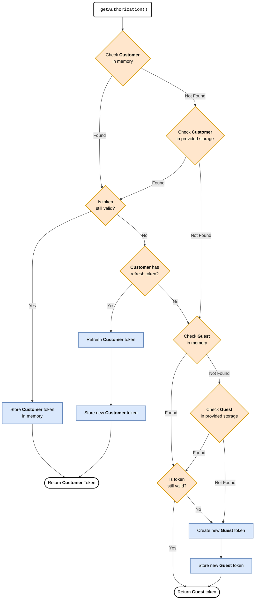

# API credentials

- [Overview](#overview)
- [Storage strategy](#storage-strategy)
- [Sales Channel](#sales-channel)
- [Integration](#integration)

## Overview

To use Commerce Layer API you need to be [authorized](https://docs.commercelayer.io/core/authentication) in the first place. This means you need to get a valid access token. The permissions you're granted authenticating with that token are determined by the type of API client you used to get it.

Authentication calls are subject to rate limiting. To avoid hitting these limits, you should cache the authentication token in a storage (e.g., cookies, Redis, KV). This prevents requesting a new token for each API call.

The `js-auth` library manages this caching mechanism out-of-the-box with two small additional helpers.

## Storage strategy

- **Built-in Memory Storage**: Provides fast access with temporary storage. Reduces load on the underlying configured storage (e.g., Redis, DB) by caching tokens in memory.
- **Configured Storage**: Can provides persistent storage that survives page reloads and browser sessions. You can implement any storage solution.
- **Customer Storage** (*Sales Channel only*): Optional dedicated storage for customer authentication tokens, separate from guest tokens.

The following flowchart illustrates how the library manages token caching, validation, and refresh flow:




## Sales Channel

[**Sales channels**](https://docs.commercelayer.io/core/api-credentials#sales-channel) are used to build any customer touchpoint (e.g. your storefront with a fully-functional shopping cart and checkout flow).

Below is a complete example showing how to use a Sales Channel for both guest and customer authentication:

```ts
const salesChannel = makeSalesChannel({
  clientId: '1234',
  scope: 'market:id:ABCD'
}, {
  // you can use any storage implementation you prefer or implement your own
  // in this example we use `unstorage` with the `localStorage` driver
  storage: createStorage({
    driver: localStorageDriver({}),
  })
})

/**
 * Get the current authorization state which includes the access token.
 * This method handles caching and token refresh automatically.
 */
const guestAuthorization = await salesChannel.getAuthorization()

/**
 * Authenticate a customer using their email and password, or
 * though the JWT Bearer flow.
 */
const customerCredentials = await authenticate('password', {
  ...
})

/**
 * Set the customer credentials in the storage.
 */
await salesChannel.setCustomer({
  accessToken: customerCredentials.accessToken,
  scope: customerCredentials.scope,

  // when `refreshToken` is provided, it'll be used
  // to automatically refresh the customer access token when it expires
  refreshToken: customerCredentials.refreshToken
})

/**
 * Get the current customer authorization.
 */
const customerAuthorization = await salesChannel.getAuthorization()

/**
 * Logout the current customer.
 * This will remove the customer authorization from the storage,
 * and revoke the access token.
 */
await salesChannel.logoutCustomer()
```

## Integration

[**Integrations**](https://docs.commercelayer.io/core/api-credentials#integration) are used to develop backend integrations with any 3rd-party system.

```ts
const integration = makeIntegration({
  clientId: '1234',
  clientSecret: 'secret-5678',
}, {
  // you can use any storage implementation you prefer or implement your own
  // in this example we use `unstorage` with the `redis` driver
  storage: createStorage({
    driver: redisDriver({ ... }),
  })
})

/**
 * Get the current authorization state which includes the access token.
 * This method handles caching and token refresh automatically.
 */
const authorization = await integration.getAuthorization()

/**
 * Revoke the current integration authorization.
 * This will remove the authorization from memory and storage,
 * and revoke the access token.
 */
await integration.revokeAuthorization()
```